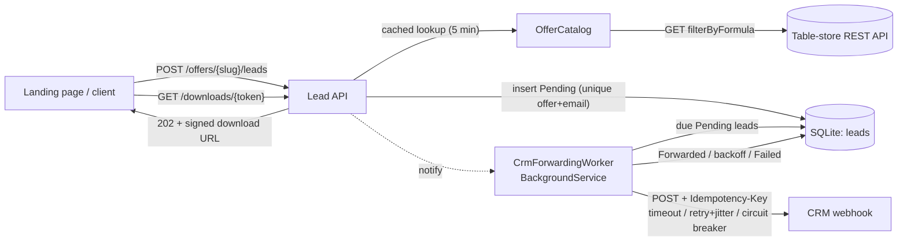

# crm-integration-service


A lead-capture API built with ASP.NET Core (.NET 10). It reads offer definitions from an external table-store API, validates and records opt-ins, forwards each lead to a CRM webhook even when that webhook is down, and returns short-lived signed download links.

**Background:** A .NET rebuild of a lead-capture service I originally wrote in JavaScript for my own coaching business.

## What it does

- **Offer lookup:** `GET /offers/{slug}` reads from a REST table store through a typed `HttpClient`. The request shape (`filterByFormula`, `records[].fields`) matches common hosted-spreadsheet APIs. Results are cached in `IMemoryCache` for 5 minutes, and misses for 30 seconds.
- **Opt-in capture:** `POST /offers/{slug}/leads` validates the request with FluentValidation and stores the lead in SQLite. Emails are normalized, and each email can opt in to a given offer only once. The response comes back immediately and includes a signed download link. The CRM being down never blocks it.
- **Reliable CRM forwarding:** a `BackgroundService` sends pending leads to the CRM webhook. Each lead carries an `Idempotency-Key` header, and every call runs through a Polly pipeline with a timeout, jittered retries, and a circuit breaker. When a call still fails, the lead stays `Pending` with exponential backoff until it succeeds or reaches the attempt limit.
- **Stateless downloads:** `GET /downloads/{token}` serves the offer's PDF if the token's HMAC signature is valid and it hasn't expired. The server stores no session state.
- **Fail-fast configuration:** options are validated at startup. Secrets come from user-secrets or environment variables, never from committed files.

## Architecture



| Folder | Responsibility |
| --- | --- |
| `Offers/` | Slug rules, `ITableStoreClient` (HTTP and in-memory sample implementations), `OfferCatalog` cache, `GET /offers/{slug}` |
| `Leads/` | Request validation, `LeadService` (normalize, dedupe, persist, signal), `POST /offers/{slug}/leads` |
| `Crm/` | `CrmClient` + resilience pipeline, `LeadForwarder` (attempt/backoff/give-up rules), `CrmForwardingWorker` |
| `Downloads/` | `DownloadTokenService` (HMAC tokens, `TimeProvider`-based expiry), `GET /downloads/{token}` |
| `Development/` | A `/dev/crm-sink` endpoint, mapped only in Development, that stands in for a CRM |

## Run locally

Requires the [.NET 10 SDK](https://dotnet.microsoft.com/download).

```bash
cd src/CrmIntegrationService
dotnet user-secrets set Downloads:SigningKey "$(openssl rand -base64 32)"
dotnet run
```

The API listens on `http://localhost:5090`, and the OpenAPI document is at `/openapi/v1.json`. In Development it needs no external accounts:

- `TableStore:Mode` is `Sample`, which serves one synthetic offer (`starter-checklist`).
- `Crm:WebhookUrl` points at the app's own `/dev/crm-sink`, which logs every forwarded lead.

To use real services, set the following (environment variables shown; user-secrets work too):

```bash
export TableStore__Mode=Http
export TableStore__BaseUrl=https://api.your-table-store.example
export TableStore__ApiKey=...            # sent as a Bearer token
export TableStore__DatabaseId=...
export TableStore__Table=Offers          # needs Slug, Title, Summary, Status ("Live") fields
export Crm__WebhookUrl=https://your-crm.example/hooks/leads
```

Outside Development, the app refuses to start if any of these are missing or invalid.

## API examples

```bash
curl -s http://localhost:5090/offers/starter-checklist
```
```json
{"slug":"starter-checklist","title":"Starter Checklist","summary":"A one-page synthetic checklist used to demo the download flow."}
```

```bash
curl -s -i -X POST http://localhost:5090/offers/starter-checklist/leads \
  -H "Content-Type: application/json" \
  -d '{"name":"Ada","email":"ada@example.com"}'
```
```http
HTTP/1.1 202 Accepted

{"leadId":"01a0af9a-7e43-7cfd-b56f-523818ffe952","downloadUrl":"/downloads/c3RhcnRlci1jaGVja2xpc3R8MDFhMGFmOWE3ZTQzN2NmZGI1NmY1MjM4MThmZmU5NTJ8MTc4OTY1NjEzMw.6NuDtxVmD5-1V6C8SvjTWhc4mtqdXrcBtHAIANQexaw","downloadExpiresAt":"2026-09-17T14:42:13.0357748+00:00"}
```

Repeating the opt-in with the same email returns `200` with the same `leadId`, and the email match ignores case. An invalid body returns a standard validation problem:

```json
{"type":"https://tools.ietf.org/html/rfc9110#section-15.5.1","title":"One or more validation errors occurred.","status":400,"errors":{"Email":["Email is not a valid address."]}}
```

```bash
curl -s -o starter-checklist.pdf -w "%{http_code} %{content_type}\n" "http://localhost:5090/downloads/<token>"
# 200 application/pdf    (404 for a forged/unknown token, 410 once expired)
```

The dev CRM sink logs what a real CRM would receive:

```
CRM sink received lead (Idempotency-Key 01a0af9a7e437cfdb56f523818ffe952): {"leadId":"01a0af9a-7e43-7cfd-b56f-523818ffe952","email":"ada@example.com","name":"Ada","offerSlug":"starter-checklist","capturedAt":"2026-09-17T13:42:12.8033+00:00"}
```

## Design decisions and trade-offs

- **Capture first, forward later.** The visitor's request only writes to the local database. Forwarding runs in the background, so a slow or failing CRM never costs a lead or delays the download link. The cost is eventual consistency: the CRM usually hears about a lead within a moment, but not in the same request.
- **Retries at two time scales.** The Polly pipeline handles brief failures within a single call: a 60-second total timeout, three jittered exponential retries, a circuit breaker, and a 10-second timeout on each attempt. `LeadForwarder` handles longer outages with a database-backed `NextAttemptAt`. Backoff doubles from 30 seconds up to a 15-minute cap, and after 8 attempts the lead is marked `Failed` for a human to look at. Because this state lives in the database, a restart loses nothing.
- **At-least-once delivery with an idempotency key.** A lead can be sent twice, for example if the CRM accepted it but the response was lost. Every attempt carries the same `Idempotency-Key` (the lead id) so the receiving side can drop duplicates.
- **Order of the resilience strategies.** The retry sits outside the circuit breaker, so every attempt counts toward the breaker's failure rate. Once the breaker opens, calls fail immediately instead of hammering a CRM that is already struggling. A unit test confirms this with a fake handler.
- **Strict slugs as the injection guard.** Slugs must match `^[a-z0-9](?:[a-z0-9-]{0,62}[a-z0-9])?$` before they reach the table-store formula or a file path. That one rule prevents formula injection and path traversal, and invalid slugs are rejected before any network call.
- **Stateless signed download links.** A token is the payload `slug|leadId|expiry` plus an HMAC-SHA256 signature, both base64url-encoded. The signature is checked in constant time before the payload is trusted, so a forged token is reported as invalid, never as expired. The trade-off is that a single link can't be revoked before it expires. That's acceptable for a free guide with a one-hour lifetime.
- **Cache misses as well as hits.** A burst of requests for a mistyped slug makes one table-store call every 30 seconds, not one per request.
- **Use SQLite and `EnsureCreated`.** This keeps the demo to a single command. A production deployment would use a server database with migrations, and a multi-instance deployment would need row claiming (for example `UPDATE … WHERE status = 'Pending' RETURNING`) so that two workers never pick up the same lead.
- **Not included:** rate limiting, bot protection on the opt-in form, and consent or double opt-in flows. Any real public deployment would need them.

## Tests

```bash
dotnet test
```

- **Unit tests (54):**
  - slug rules
  - download tokens: round trip, expiry boundary, tampered payload or signature, wrong key, a forged-and-expired token reporting invalid, malformed input
  - validation rules
  - the table-store client: request shape, bearer auth, mapping, invalid slugs never sent, upstream errors
  - offer caching of hits and misses
  - the CRM resilience pipeline with a fake `HttpMessageHandler`: 503, 503, then 200 succeeds with the same idempotency key; the circuit opens after repeated failures and stops calling the CRM; a 400 is not retried
  - forwarding rules against in-memory SQLite: success, backoff, not-yet-due leads, giving up after the maximum attempts, backoff doubling and cap
- **Integration tests (10)** use `WebApplicationFactory` with stubbed table-store and CRM handlers. They cover:
  - offer lookup, and 404s for unknown or malformed slugs
  - opt-in end to end: stored, forwarded with the idempotency key, and a download that returns a real PDF
  - a repeat opt-in, validation errors, and a tampered token
  - a CRM outage: the lead is captured and downloadable, retries in the background while the CRM returns 503, and is forwarded once the CRM recovers

CI runs build, test, `dotnet format --verify-no-changes`, and a gitleaks secret scan on every push.

## License

[MIT](LICENSE)
